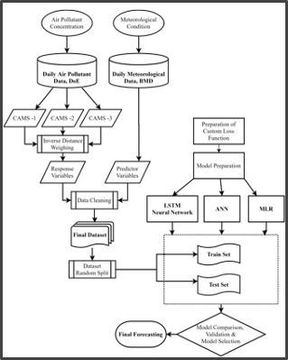
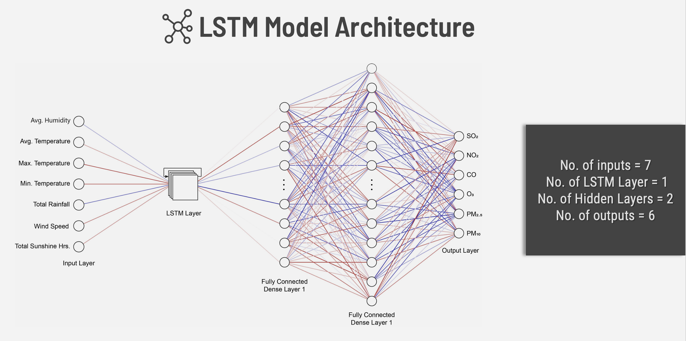
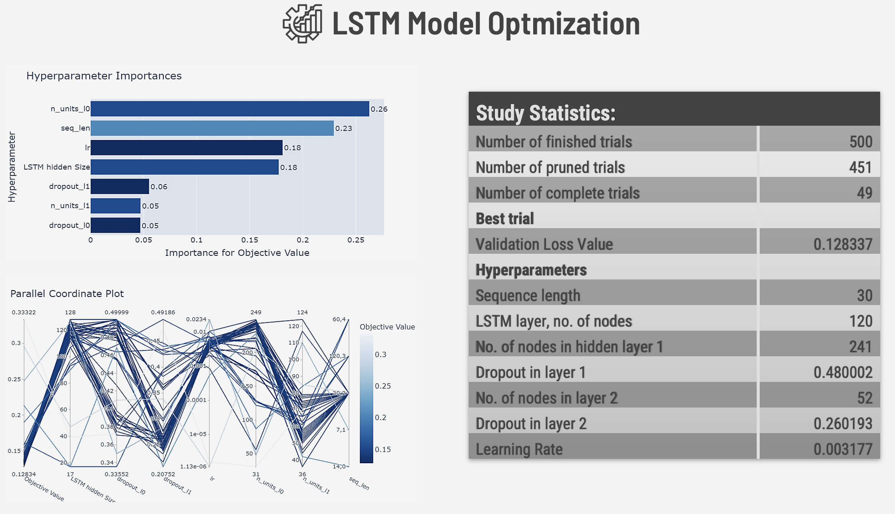
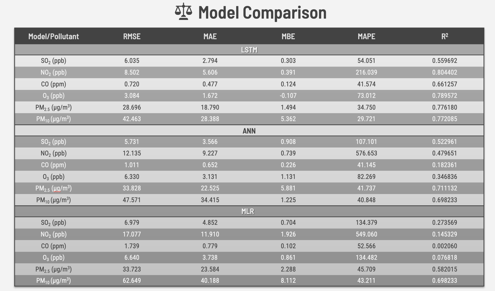

# Time-Series Forecasting of Air Pollutants using LSTMs

**An Undergraduate Thesis Project | Published: Feb. 19, 2021**

This repository contains the code and resources for the undergraduate thesis, "Forecasting Air Pollution of Dhaka City with Meteorological Parameters Using Deep Learning-Based Approach." The project focuses on developing and optimizing a Long Short-Term Memory (LSTM) Recurrent Neural Network to forecast the concentration of six criteria air pollutants.

## Project Objective

The primary goal was to design a deep learning model capable of accurately forecasting air quality in Dhaka, a city with significant pollution challenges. The project compares the performance of a novel LSTM model against traditional ANN and MLR models, aiming to provide a more accurate tool for an early warning/alert system.

## Key Accomplishments

*   **Developed a high-performance LSTM model** using PyTorch that demonstrated superior accuracy in forecasting concentrations of six different air pollutants compared to baseline ANN and MLR models.
*   **Engineered a complex data preprocessing pipeline** to handle real-world, sparse sensor data, utilizing Inverse Distance Weighting to create a uniform dataset from multiple sources.
*   **Executed a rigorous hyperparameter optimization process** using the Optuna framework, running 500 trials to identify the best-performing model architecture and training parameters.
*   **Successfully validated the model's effectiveness**, confirming that LSTMs are highly capable of predicting complex, non-linear time-series data like air pollutant concentrations.

## Methodology

The project followed a comprehensive methodology from data collection and feature engineering to model training, optimization, and comparison.

**1. Data Collection & Preprocessing:**
*   **Data Sources:** Air pollutant data from 3 CAMS stations and meteorological data from the BMD station in Dhaka (2013-2018).
*   **Feature Engineering:** To handle data from geographically distinct stations, Inverse Distance Weighting (IDW) was used to generate a uniform dataset.
*   **Data Cleaning:** Entries with no response variables were eliminated, and seasonal trend analysis was performed for both wet and dry periods.

**2. Model Architecture & Training:**
*   A Recurrent Neural Network using an **LSTM layer** was designed to capture temporal dependencies in the time-series data.
*   The model architecture was optimized to forecast six pollutants (SO₂, NO₂, CO, O₃, PM₂.₅, PM₁₀) simultaneously.

**3. Hyperparameter Optimization:**
*   The **Optuna** framework was used to systematically search for the optimal set of hyperparameters for the LSTM model.
*   Over 500 trials were run, tuning parameters like sequence length, number of nodes, dropout rates, and learning rate. This data-driven approach was critical to achieving the final model's high performance.

## Results

The final, optimized LSTM model significantly outperformed both the ANN and MLR baseline models across a majority of pollutants, as measured by RMSE, MAE, and R² scores. The results confirm that the LSTM's ability to retain long-term memory is highly effective for this forecasting task.

## Technologies Used

*   **Language:** Python (3.8.3)
*   **Core Libraries:** PyTorch (1.7.0), Pandas, Scikit-Learn, NumPy
*   **Hyperparameter Optimization:** Optuna (1.5.0)
*   **Tools:** Jupyter Notebook

## How to Run
1.  Clone this repository.
2.  The datasets used are located in the `/data` folder.
3.  The Jupyter Notebooks in the `/notebooks` folder contain the complete workflow, from data exploration and cleaning to model training and final evaluation.